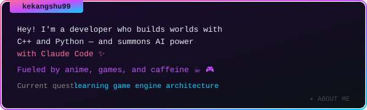

<!-- ═══════════════════════ BANNER ═══════════════════════ -->

<!-- ════════════════════ VN DIALOGUE ════════════════════ -->

<!-- ══════════════════ STATUS WINDOW ═══════════════════ -->

## 📋 STATUS WINDOW

<!-- ════════════════════ QUEST LOG ══════════════════════ -->

## 📜 QUEST LOG

| Status | Quest | Description |
|--------|-------|-------------|
| ✅ `COMPLETED` | [Game1](https://github.com/kekangshu99/Game1) | DirectX graphics engine — lighting, shadow mapping, SSAO, particle systems in HLSL |

<!-- ══════════════════ CONTRIBUTION SNAKE ═════════════ -->

## 🐍 CONTRIBUTION SNAKE

<picture>
  <source media="(prefers-color-scheme: dark)" srcset="https://raw.githubusercontent.com/kekangshu99/kekangshu99/output/github-contribution-grid-snake-dark.svg">
  <source media="(prefers-color-scheme: light)" srcset="https://raw.githubusercontent.com/kekangshu99/kekangshu99/output/github-contribution-grid-snake.svg">
  
</picture>

<!-- ═══════════════════ DYNAMIC STATS ══════════════════ -->

## 📊 STATS

<!-- ════════════════════ SAVE POINT ═════════════════════ -->

## 💾 SAVE POINT

